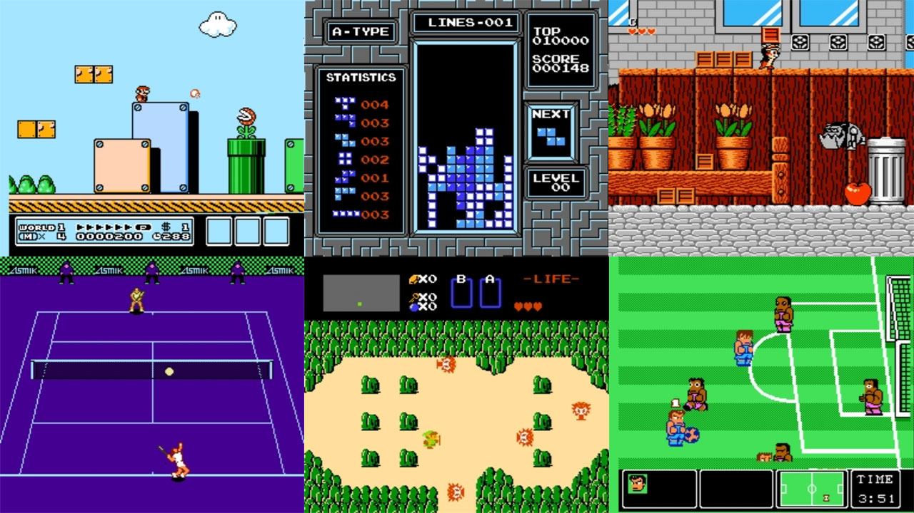

# Nintendo - NES / Famicom (QuickNES)

### Description

A port of the QuickNES core library, originally by Shay Green, heavily modified. QuickNES is a newer emulator that seems to have good compatibility.

### License

LGPLv2.1+

### Icon

### Fanart

Help make me fanart!

### Screenshots

